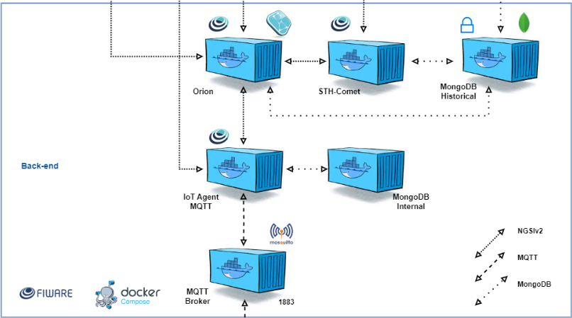

# 🏃‍♀️ FIWARE + ESP32 Heart Rate Monitor

## 📌 Descrição do Projeto
Este projeto demonstra o uso de **IoT + FIWARE** para monitoramento de **batimentos cardíacos (BPM)** de uma jogadora de futebol feminino em tempo real.  

A solução utiliza um **ESP32** conectado a um **potenciômetro** (simulando o sensor de frequência cardíaca) no **Wokwi**, que envia os dados via **MQTT** para o **IoT Agent MQTT**, que por sua vez repassa para o **Orion Context Broker**.  

Além disso, o ESP32 recebe **comandos** para ligar/desligar o LED onboard, representando uma interação remota entre o sistema e o dispositivo.  

O **STH-Comet** é usado para persistir os dados históricos de batimentos no **MongoDB**, permitindo consultas e análises posteriores.

📺 [Visualizar Explicação do Projeto no YouTube](https://youtube.com)

👉 [Visualizar Projeto no Wokwi](https://wokwi.com/projects/442202130178019329)

---

## 🏗 Arquitetura



**Fluxo de dados:**
1. O ESP32 coleta os batimentos (simulados pelo potenciômetro).  
2. Os valores são enviados via **MQTT** para o **IoT Agent**.  
3. O IoT Agent traduz para NGSI-v2 e armazena no **Orion Context Broker**.  
4. O **STH-Comet** subscreve os dados e armazena no **MongoDB Histórico**.  
5. O usuário pode consultar em tempo real ou recuperar o histórico via **Postman**.  
6. O LED pode ser controlado remotamente (on/off) via Orion.

---

## ⚙️ Tecnologias Utilizadas
- **ESP32** (simulado no Wokwi)  
- **Potenciômetro** (simulação do sensor de batimentos)  
- **FIWARE**:
  - Orion Context Broker  
  - IoT Agent MQTT  
  - STH-Comet  
  - MongoDB  
- **MQTT (Mosquitto)**  
- **Postman** (requisições REST)  
- **Docker Compose** (orquestração dos contêineres)  
- **Microsoft Azure** (VM para execução da stack FIWARE)

---

## ☁️ Ambiente de Execução (Azure)

Para hospedar a stack do **FIWARE Descomplicado**, foi utilizada uma **máquina virtual (VM)** provisionada no **Microsoft Azure**, aproveitando os créditos disponibilizados pela FIAP.  

### Configuração da VM
- **Provedor**: Microsoft Azure  
- **Sistema Operacional**: ubuntu-24_04-lts 
- **Tamanho da VM**: B1s
- **Rede**: portas públicas habilitadas para:  
  - `1883` (MQTT)  
  - `4041` (IoT Agent MQTT)  
  - `1026` (Orion Context Broker)  
  - `8666` (STH-Comet)
  - `27017` (Mongo-db)
    
  Essas portas de entrada utilizam o protocolo TCP
 
### Acessar a Máquina Virtual

Execute em uma shell local à sua escolha:
```bash
cd Downloads

ssh -i <private-key-file-path> <username>@<ip-da-vm>

sudo apt update

sudo apt install docker.io

sudo apt install docker-compose
```

### Instalação do FIWARE
Na VM execute:  
```bash
git clone https://github.com/fabiocabrini/fiware

cd fiware

sudo docker compose up -d
```

Isso inicializa todos os contêineres necessários (Orion, IoT Agent, MongoDB, Mosquitto, STH-Comet).  

---

## 📂 Estrutura do Projeto
```
├── sketch.ino                   # Código do ESP32
├── FIWARE Descomplicado Heart Rate.postman_collection.json  # Collection Postman
├── backend-diagram.png          # Arquitetura do Backend
└── README.md                    # Documentação
```

---

## 🚀 Como Executar

### 1. Subir o Backend FIWARE
Execute na pasta do FIWARE:
```bash
docker compose up -d
```

### 2. Simular o Dispositivo no Wokwi
Abra o [Wokwi](https://wokwi.com) e carregue o arquivo `sketch.ino`.  
O potenciômetro irá simular os batimentos cardíacos, e o LED receberá comandos remotos.

### 3. Importar Collection no Postman
Importe o arquivo `FIWARE Descomplicado Heart Rate.postman_collection.json` no Postman.  
Altere a variável `{{url}}` para o IP/host onde está rodando seu FIWARE.

### 4. Encerramento
Execute na pasta do FIWARE:
```bash
sudo docker-compose down
```

---

## 🔌 Principais Requisições (Postman)

### IoT Agent
- **Provisionar serviço MQTT**  
- **Registrar dispositivo Player (Player:001)** com atributos:  
  - `heart_rate` (Integer)  
  - `status` (Text)  
  - `led_state` (Text)  

### Orion Context Broker
- **Consultar dados em tempo real**  
```http
GET http://{{url}}:1026/v2/entities/urn:ngsi-ld:Player:001?attrs=heart_rate,status
```

### STH-Comet
- **Consultar histórico de batimentos**  
```http
GET http://{{url}}:8666/STH/v1/contextEntities/type/Player/id/urn:ngsi-ld:Player:001/attributes/heart_rate?lastN=30
```

### Comandos
- **Acender LED**
```http
PATCH http://{{url}}:1026/v2/entities/urn:ngsi-ld:Player:001/attrs
{
  "on": { "type": "command", "value": "" }
}
```

- **Apagar LED**
```http
PATCH http://{{url}}:1026/v2/entities/urn:ngsi-ld:Player:001/attrs
{
  "off": { "type": "command", "value": "" }
}
```

---

## 🎯 Resultados Esperados
- Monitoramento contínuo dos **batimentos cardíacos** da jogadora.  
- Histórico armazenado no **MongoDB** para análises.  
- Capacidade de **interação remota** (acender/apagar LED).  

---

## 👥 Autores
1ESPF:
- Pedro Alves Faleiros - 562523  
- Luan Felix - 565541  
- João Lopes - 565737  
- Leandro Farias - 566488

1ESPG:
- Felipe Campos - 562752
